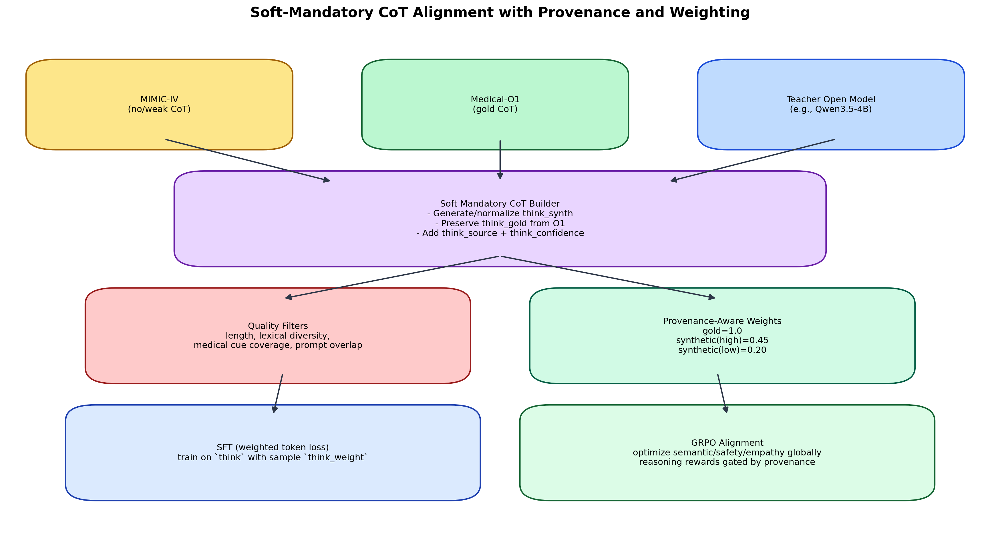

# Soft-Mandatory CoT Alignment Methodology

This technical note documents how the MDT pipeline aligns mixed reasoning datasets using **soft mandatory CoT supervision** with explicit **provenance** and **per-sample weighting**.

## Why this design

When one dataset has strong chain-of-thought supervision (Medical-O1) and another has weak/noisy reasoning (MIMIC-derived), forcing identical hard supervision can degrade robustness. The adopted strategy keeps CoT available for every sample, but down-weights synthetic reasoning relative to gold reasoning.

## Methodology figure

## Pipeline steps

1. **Source normalization**
   - Assign `source` metadata (`mimic`, `medical_o1`).
2. **Soft CoT construction**
   - Preserve `think_gold` for O1 examples.
   - Build/normalize `think_synth` for non-gold examples.
3. **Quality filtering**
   - Evaluate synthetic reasoning with:
     - minimum length/word checks,
     - lexical diversity,
     - medical cue coverage,
     - prompt-term overlap.
4. **Provenance tagging**
   - Add `think_source`, `think_confidence`, `think_quality_score`, and `think_quality_pass`.
5. **Weight assignment**
   - `think_weight=1.0` for gold CoT,
   - `think_weight=0.45` for synthetic/high-quality,
   - `think_weight=0.20` for synthetic/low-quality.
6. **Weighted SFT optimization**
   - Use per-sample `think_weight` in causal-LM loss aggregation.
7. **GRPO alignment**
   - Continue global reward optimization; reasoning-sensitive rewards can be gated by provenance.

## New data columns

The preprocessing stage now emits:

- `think_gold`
- `think_synth`
- `think_source`
- `think_confidence`
- `think_quality_pass`
- `think_quality_score`
- `think_weight`
- `think_teacher_model`

The canonical reasoning fields remain:

- `think`
- `reasoning`

Both point to the final aligned reasoning used by the training prompt formatter.

## Configuration knobs

These parameters are available in `config/configs.py` under `DataConfig`:

- `soft_think_enabled`
- `think_teacher_model`
- `think_quality_min_chars`
- `think_quality_min_words`
- `think_weight_gold`
- `think_weight_synth_high`
- `think_weight_synth_low`

## Code integration points

- `data/think_alignment.py` → core soft-mandatory alignment logic.
- `main.py` and `medical_digital_twin_master.py` → apply alignment after combining MIMIC + O1.
- `data/dataset.py` → emit `think_weight` and robust reasoning field selection.
- `training/sft_trainer.py` → weighted token loss in both Trainer and fallback loop.

## Operational recommendation

Use this strategy as default for mixed-source training. Move toward higher synthetic weights only after periodic quality audits confirm stable gains in semantic correctness and safety metrics.
